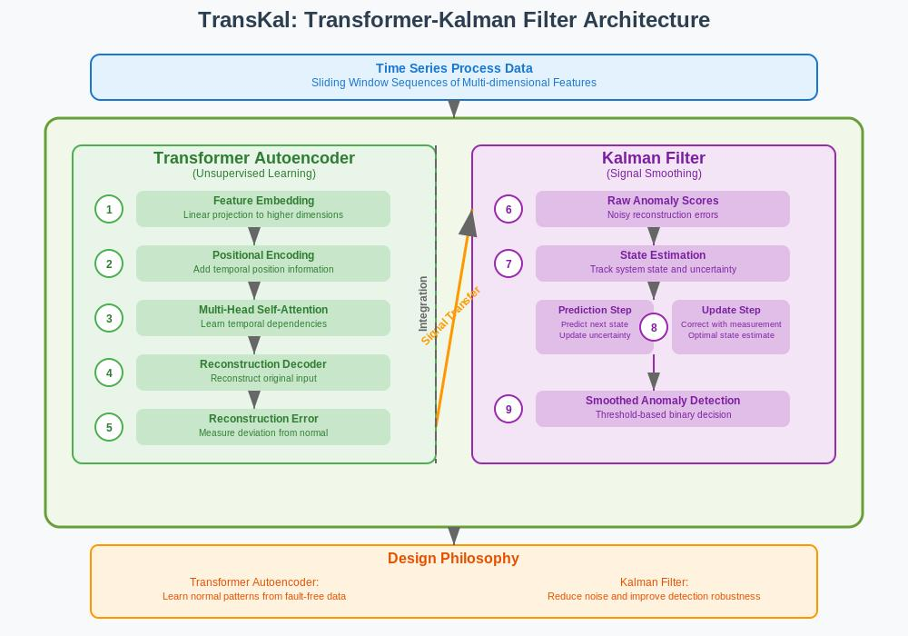

# TransKal



A Python package for time series anomaly detection using Transformer neural networks and Kalman filtering. This package is designed for general-purpose anomaly detection across various time series data and has been tested on the Tennessee Eastman Process (TEP) dataset.

## Features

- Transformer-based model with positional encoding
- Kalman filtering for smoothing predictions
- Easy training and evaluation API
- Support for custom datasets
- Visualization tools for model performance

## Installation

1. Clone this repository:
   ```
   git clone https://github.com/naixinlyu/TransKal.git
   cd TransKal
   ```

2. Install dependencies:
   ```
   pip install -r requirements.txt
   ```

## Usage

### Quick Start with Command Line

The simplest way to train and evaluate an anomaly detection model on your dataset is using the `run.py` script:

```bash
python run.py --train path/to/training_data.csv --test path/to/testing_data.csv --label-col label
```

For a dataset that doesn't have labels but has a known fault start time:

```bash
python run.py --data path/to/data.csv --fault-start 500 --train-ratio 0.7
```

### Custom Example with Command Line

For more advanced usage with custom time series data:

```bash
python examples/custom_example.py --data path/to/data.csv --label-col anomaly --time-col timestamp --feature-cols "feature1,feature2,feature3" --lookback 20 --epochs 50
```

### TEP Dataset Example

If you have the Tennessee Eastman Process dataset in RData format:

```bash
python examples/tep_example.py
```

#### Performance Results on TEP Dataset

| Fault Type | F1 Score | Accuracy |
|------------|----------|----------|
| 1          | 0.9344   | 0.8769   |
| 2          | 0.9291   | 0.8677   |
| 3          | 0.9348   | 0.8776   |
| 4          | 0.9324   | 0.8733   |
| 5          | 0.9350   | 0.8780   |
| 6          | 0.9368   | 0.8811   |
| 7          | 0.9351   | 0.8782   |
| 8          | 0.9282   | 0.8661   |
| 9          | 0.9998   | 0.9997   |
| 10         | 0.9215   | 0.8544   |
| 11         | 0.9379   | 0.8832   |
| 12         | 0.9337   | 0.8756   |
| 13         | 0.9204   | 0.8527   |
| 14         | 0.9341   | 0.8763   |
| 16         | 0.9325   | 0.8736   |
| 17         | 0.9240   | 0.8588   |
| 18         | 0.9201   | 0.8520   |
| 19         | 0.9351   | 0.8782   |
| 20         | 0.9259   | 0.8621   |
| **Average**| **0.9343** | **0.8771** |

For detailed implementation and analysis, please see [Fault_Detection_with_Transformer_and_Kalman_Filter_for_TEP.ipynb](Fault_Detection_with_Transformer_and_Kalman_Filter_for_TEP.ipynb)

### Python API Example

You can also use the package directly in your Python code:

```python
from anomaly_detection import AnomalyDetector, DataProcessor
import numpy as np

# Prepare data
X_train = ...  # Training features
y_train = ...  # Training labels
X_test = ...   # Testing features
y_test = ...   # Testing labels

# Initialize data processor
processor = DataProcessor(lookback=15, batch_size=16)
data = processor.prepare_data(X_train, y_train, X_test, y_test)

# Initialize and train the model
model = AnomalyDetector(input_dim=data['feature_dim'])
model.train_model(
    model_name='my_model',
    train_loader=data['train_loader'],
    val_loader=data['val_loader'],
    num_epochs=30
)

# Evaluate model
results = model.evaluate(
    data['X_test_windows'],
    data['y_test_windows'],
    threshold=0.5
)

print(f"F1 Score: {results['metrics']['f1']:.4f}")
```

## File Structure

```
TransKal/
├── README.md
├── requirements.txt
├── anomaly_detection/
│   ├── __init__.py
│   ├── models/
│   │   ├── __init__.py
│   │   ├── transformer.py
│   │   └── kalman_filter.py
│   ├── data/
│   │   ├── __init__.py
│   │   └── dataset.py
│   ├── utils/
│   │   ├── __init__.py
│   │   └── visualization.py
│   └── trainer.py
├── examples/
│   ├── tep_example.py
│   └── custom_example.py
├── run.py
└── Fault_Detection_with_Transformer_and_Kalman_Filter_for_TEP.ipynb
```

## Model Architecture

The anomaly detection model consists of two main components:

1. **Transformer Model**: Uses self-attention mechanisms to capture temporal dependencies in time series data
2. **Kalman Filter**: Applied to smooth the model predictions and reduce false positives

## Parameters

The model accepts several parameters that can be tuned for your specific dataset:

- `lookback`: Number of time steps to look back (window size)
- `d_model`: Hidden dimension of the transformer model
- `nhead`: Number of attention heads
- `num_layers`: Number of transformer encoder layers
- `dropout`: Dropout probability for regularization
- `Q`: Process noise for Kalman filter
- `R`: Measurement noise for Kalman filter

## Input Data Format

For CSV files, the expected format is:

- One row per time step
- Columns for features
- A column for labels (0 for normal, 1 for anomaly)
- Optional time column for time series data

## Acknowledgments

The Tennessee Eastman Process (TEP) dataset is a benchmark dataset for process monitoring and fault detection in chemical processes, originally developed by Downs and Vogel.
